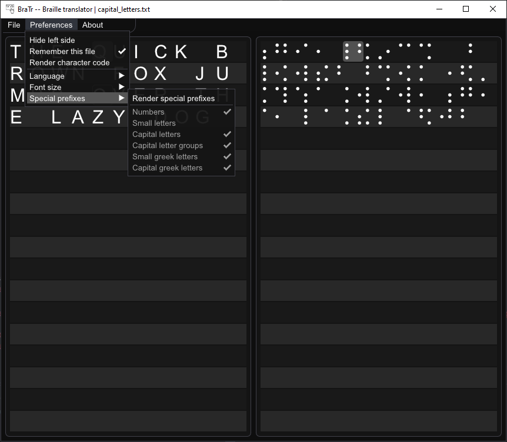

# Braille Translator (BraTr)

BraTr allows a real-time translation between regular text and braille letters. It can support more languages and more languages can be added over time. The program allows users to open a text file with containing text they want to translate. The contents of the text file is then translated and can be viewed inside the program.

  </img>

# List of Languages Supported

So far the so called _Atlas_ can be extended only by modifying the code and defining each letter inside a table that can be found inside _BrailleCharacterAtlas.cpp_.

| Language | Supported |
| -------- | :-------: |
| Czech    | :heavy_check_mark:       |
| English  | :heavy_check_mark:       |

# Special Thanks

Special thanks to [imgui](https://github.com/ocornut/imgui) which provides great and flexible API for designing UI in an application.

Also thanks to [portable-file-dialogs](https://github.com/samhocevar/portable-file-dialogs) for a great and easy way of displaying file dialogs.

# Compiling

The program was tested on Windows 10 and was compiled inside Visual Studio 2019.

# Things To Do

- :x: Add more flexible way of adding more letters into the atlas. Perhaps some editor for defining letters and then storing the result in a file which the program would then load?
- :x: Add more flexible way of adding bigger language support to the program, perhaps again using some text file system for each language?
- :heavy_check_mark: Make both translation sides scrollable.
- :x: Add some context menu, where the user could select font from the Windows\\Fonts directory and the program would automatically load N same fonts of different sizes.
- :x: Make the program x64-compatible. At this point, we can only compile in x86 mode.
- :heavy_check_mark: Make it possible to select previous loaded files from the context menu.
- :heavy_check_mark: Add more customization to the braille letter renderer (e.g. add options for things such as dot invards shift, dot size, strip colors, dot translucence, etc.)
